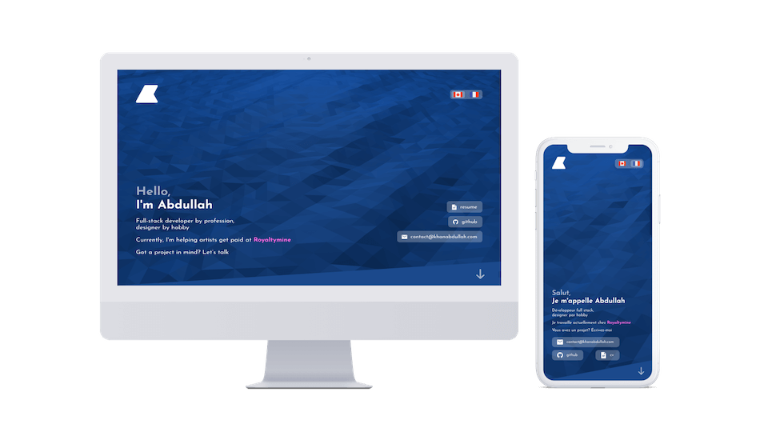

# [khanabdullah.com](https://khanabdullah.com)

🌎 v2.0 of my personal website. Built with [Pug](https://github.com/pugjs/pug#pug), [SASS](https://sass-lang.com/), and [Gulp](https://gulpjs.com/). Deployed on [Netlify](https://www.netlify.com/).

## Installation
To run the site locally:
- `git clone https://github.com/abdullah-K/khanabdullah.com`
- `yarn install`
- `yarn dev`

To produce the dist/ folder without watching files, run:
- `yarn prod`

## Version 1
[khanabdullah.com v1.0](https://github.com/abdullah-K/khanabdullah.com/tree/v1)

## Thanks
[Icons8](https://icons8.com)

[Vanta.js](https://www.vantajs.com/)
